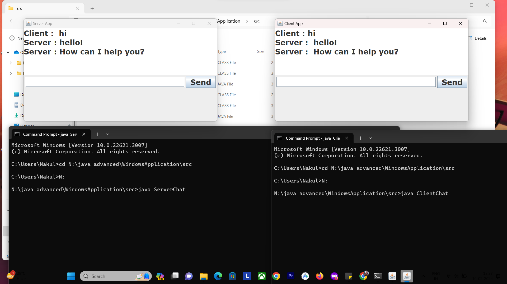

# Windows Chatting Application 


## Tools & Technologies
- ☕ Java
- 🚀 Advanced Java
- 📡 Socket Programming
- 🎨 Swing

## Project Overview
🌟 **Description:**
Windows Chatting Application 2022 is a personal project that implements a chat application using core Java and advanced Java concepts such as socket programming and Swing.

## Features
- 💬 Real-time chat between server and client.
- 🌐 Utilizes socket programming for communication.
- 🎨 User-friendly graphical interface with Swing.

## Getting Started
1. **Clone the repository:**
    ```bash
    git clone https://github.com/your-username/Windows-Chatting-Application-2022.git
    ```

2. **Compile and Run:**
    - Open a terminal or command prompt.
    - Navigate to the project directory.
    - Compile and run the ServerChat.java and ClientChat.java files.
      ```bash
      javac ServerChat.java
      java ServerChat
      ```
      ```bash
      javac ClientChat.java
      java ClientChat
      ```

3. **Usage:**
    - Start the ServerChat application to generate a port.
    - Connect clients to this port to establish a chat connection.
    - Engage in a chat using the application.

## Screenshots



## Known Issues
🛑 Document any known issues or limitations of your application.

## Contributing
🤝 Feel free to contribute to this project. Fork the repository, make your changes, and submit a pull request.


## Acknowledgments
🙏 This project is developed using Java, Advanced Java, Socket Programming, and Swing.

---

**Happy chatting!** 🚀
